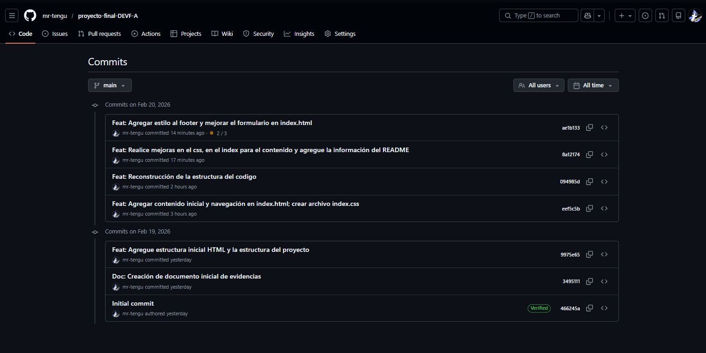
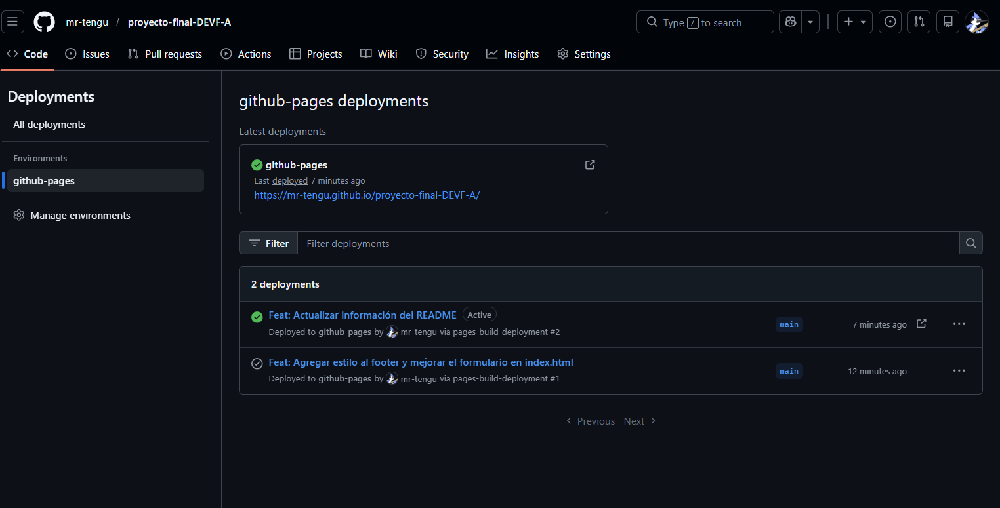

# 📁 Evidencias del Proyecto

Este documento contiene las evidencias del desarrollo y despliegue del
proyecto final.

------------------------------------------------------------------------

## 🖼️ Evidencias Visuales

Las siguientes imágenes se encuentran dentro de la carpeta:

    /evidencias

### 1️⃣ Historial de Commits

------------------------------------------------------------------------

### 2️⃣ Vista del Proyecto en GitHub Pages

------------------------------------------------------------------------

## 🌍 Enlace a GitHub Pages

🔗 **Liga del proyecto desplegado:**\
`https://mr-tengu.github.io/proyecto-final-DEVF-A/`
------------------------------------------------------------------------

# 🧠 Aprendizajes

## 1. ¿Qué fue lo más fácil y lo más retador?

**Respuesta:**
Lo más sencillo fue estructurar el contenido inicial en HTML, ya que comprendía claramente la jerarquía básica del documento y la organización de los elementos. Lo más retador fue lograr una correcta maquetación con CSS, especialmente en la alineación de elementos, manejo de espacios y estructura visual. También representó un desafío mantener el código ordenado y aplicar buenas prácticas desde el inicio, entendiendo que un proyecto escalable requiere claridad y consistencia en la estructura.

------------------------------------------------------------------------

## 2. ¿Qué etiquetas semánticas usaste y por qué?
**Respuesta:**
Utilicé etiquetas semánticas como:
- header → Para definir la cabecera principal del sitio.
- nav → Para estructurar la barra de navegación.
- section → Para dividir el contenido en bloques temáticos.
- article → Para contener contenido independiente dentro de una sección.
- footer → Para la parte final del sitio con información complementaria.
Decidí utilizar etiquetas semánticas porque mejoran la accesibilidad, la legibilidad del código y favorecen el posicionamiento en buscadores (SEO). Además, permiten que el documento tenga una estructura lógica y profesional.

------------------------------------------------------------------------

## 3. ¿Cómo organizaste tus commits?

**Respuesta:**
Organicé los commits de manera progresiva y por funcionalidad, separando los cambios en pequeñas mejoras específicas, por ejemplo:

- Estructura base en HTML
- Estilos generales en CSS
- Ajustes de diseño
- Correcciones menores

Intenté mantener mensajes descriptivos y claros para que el historial de commits reflejara la evolución del proyecto. Esto facilita la trazabilidad de cambios y simula un flujo de trabajo más profesional.

------------------------------------------------------------------------

## 4. ¿Qué mejorarías en la siguiente iteración?

**Respuesta:**
En una siguiente versión del proyecto me gustaría poder hacer lo siguiente:

- Mejorar la responsividad para distintos dispositivos.
- Optimizar el código CSS para hacerlo más modular.
- Implementar mejores prácticas de accesibilidad.
- Aplicar una metodología más estructurada como BEM para el nombrado de clases.
- Añadir animaciones sutiles para mejorar la experiencia de usuario.

Considero que este proyecto fue una base sólida, pero siempre hay espacio para optimización y refinamiento técnico.

------------------------------------------------------------------------

## 👨‍💻 Autor

**Jose de Jesus Zarate**\
Proyecto Final -- DEVF\
HTML & CSS
